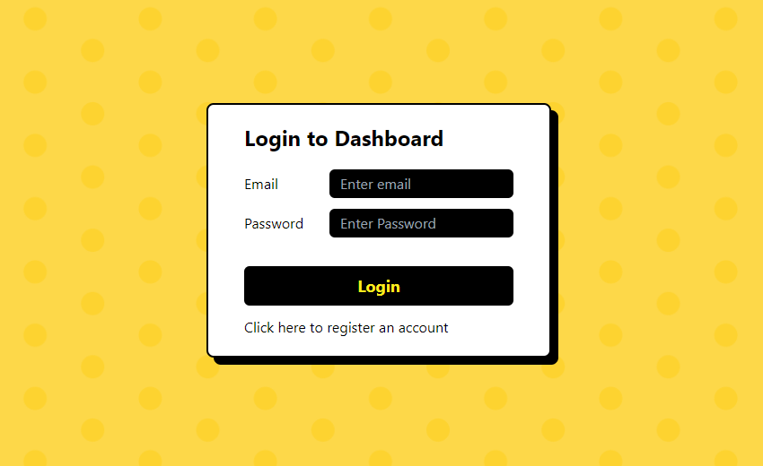

<div>
  <div align="center">
    <h1 style="font-weight: bold">Mighty Jaxx Dashboard</h1>
    
    <br />
    <p align="center">
    This repository was created to participate in the coding challenge for Full Stack Engineer position. You can find out more details about the challenge <a href="https://github.com/Mighty-Jaxx-International-Pte-Ltd/Coding-Challenge-for-Full-Stack-Engineers">here</a>.  
    </p>
    <a href="https://mighty-jaxx-fse.vercel.app/">Project Demo</a>
    </div>
</div>

## Table of Contents

- [Table of Contents](#table-of-contents)
- [Built-with](#built-with)
- [Getting Started](#getting-started)
- [Setting up Environment Variable](#setting-up-environment-variables)

<br />

## Built-with

- [Next.js](https://nextjs.org/)
- [Tailwind CSS](https://tailwindcss.com/)
- [ExpressJS](https://expressjs.com/)
- [MongoDB](https://www.mongodb.com/atlas/database)

## Hosted on

- [Vercel](https://vercel.com/)
- [Render](https://render.com/)

<br />

<!-- GETTING STARTED -->

## Getting Started

This is an example of how you can set up your project locally. To get a local copy up and running follow these simple example steps.

1. Fork the repo

2. Clone the repo

```sh
git clone with HTTPS          https://github.com/helloitsm3/mighty-jaxx-fse.git
git clone with SSH            git@github.com:helloitsm3/mighty-jaxx-fse.git
git clone with Github CLI     gh repo clone helloitsm3/mighty-jaxx-fse
```

3. Development (frontend)

```sh
1. Open the project in VS Code
2. cd frontend
3. npm install
4. npm run dev
```

4. Development (backend)

```sh
1. Open the project in VS Code
2. cd backend
3. npm install
4. npm run start
```

## Setting up Environment Variables

### Backend

1. DB_HOST - This is your MongoDB URL. You can create your own MongoDB instance from [here](https://www.mongodb.com/atlas/database)

2. TOKEN_SECRET - This is your JWT token secret. It is required to verify / sign your JWT token. You can generate it [here](https://bitwarden.com/password-generator/)

3. IMGBB_KEY - This is your IMGBB API Key. This is required if you want to upload your image on this platform. You can get it [here](https://api.imgbb.com/)

```env
DB_HOST=
TOKEN_SECRET=
IMGBB_KEY=
```

### Frontend

1. NEXT_PUBLIC_TOKEN_SECRET - This is the same JWT token you generated for your backend `TOKEN_SECRET`

.env.local

```env
NEXT_PUBLIC_TOKEN_SECRET=
```
